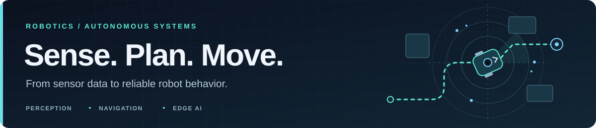

  

<h1 align="center">Aditya Varun Dhayapulay</h1>

  <strong>Robotics &amp; Autonomous Systems Engineer</strong> 
  Autonomous vehicles · Industrial robotics · Embedded systems · Edge AI

  
  
  

  <a href="#about">About</a> · <a href="#experience">Experience</a> · <a href="#selected-projects">Projects</a> · <a href="#toolbox">Toolbox</a> · <a href="#open-source">Open source</a>

## About

I build robotics systems that connect **perception, localization, and navigation** with real hardware. My work spans C++17 and Python, ROS 2 autonomy, multi-sensor fusion, industrial automation, and simulation-based validation—with an emphasis on debugging, fault recovery, and reliable operation.

Based in **California, USA** · **M.S. Computer Science, CSU Fullerton** · Graduated **August 2026**, GPA **3.8/4.0**.

## Experience

**Caterpillar, USA — Robotics System Engineer** · Aug 2025 – Present

- ROS 2 autonomy for Cat 777 quarry trucks: C++17 sensor fusion, LiDAR/radar/camera integration, SLAM, and Nav2 navigation.
- Perception, sensor calibration, digital twins, and Docker-based regression testing across autonomous driving scenarios.

**Tata Motors, India — Robotics Engineer** · Jun 2022 – Jun 2024

- ABB, FANUC, and KUKA robot integration with Siemens PLCs, Profinet, and vision inspection; reduced cycle time by **12%**.
- Commissioning, fault recovery, and Python/OPC-UA production monitoring; reduced unplanned stoppages by **8%**.

## Selected projects

### Autonomous Mobile Robot Digital Twin & Fault Recovery

Investigated unexpected robot stops using LiDAR, robot-state, and orientation telemetry. Traced false obstacle detections to robot tilt and added monitoring and automated recovery.

> **~63 minutes unattended · Zero failures**

`NVIDIA Isaac Sim` `ROS 2` `Python` `Reinforcement Learning` `LiDAR`

### [PCB Defect Detection for Embedded Visual Inspection](https://github.com/adit24dhaya/Capstone_project)

Benchmarked YOLO11 and RT-DETR for six-class PCB inspection, with ONNX export and a documented Jetson/TensorRT deployment path. The live app provides annotated detections, per-class counts, and JSON/CSV export.

> **98.3% precision · 98.8% recall · 0.99 mAP50**

**[Repository](https://github.com/adit24dhaya/Capstone_project)** · **[Live demo](https://adiivd-pcb-defect-detection.hf.space)** · Accepted publication at **ESCS’26 / CSCE’26**

<strong>More projects</strong> — fraud detection &amp; healthcare agents

- **[Real-Time Fraud & Transaction Risk Pipeline](https://github.com/adit24dhaya/fraud-risk-pipeline):** XGBoost scoring, SHAP explainability, drift monitoring, FastAPI, and Streamlit.
- **[Healthcare Agent System](https://github.com/adit24dhaya/healthcare-agent-system):** Multi-agent decision support with retrieval, risk modeling, and explainability.

## Toolbox

  
  
  
  
  
  

| Focus | Tools & technologies |
| :--- | :--- |
| **Robotics & autonomy** | ROS 2, Nav2, MoveIt2, ros2_control, SLAM, EKF/UKF sensor fusion |
| **Perception & edge AI** | OpenCV, PCL, CUDA, TensorRT, ONNX, NVIDIA Jetson |
| **Sensors & systems** | LiDAR, radar, cameras, IMU, GNSS, Linux, CAN, I2C, SPI |
| **Industrial automation** | Siemens PLCs, ABB/FANUC/KUKA, Profinet, OPC-UA, HMI/SCADA |
| **Simulation & validation** | Isaac Sim, Gazebo, CARLA, MuJoCo, Docker, Git/GitHub, CI/CD |

**Also:** PyTorch, TensorFlow, MATLAB, Bash.

## Open source

Selected **merged** contributions:

- **[skorch #1141](https://github.com/skorch-dev/skorch/pull/1141)** — automatic device selection.
- **[falsify-inspect](https://github.com/studio-11-co/falsify-inspect/pulls?q=is%3Apr+is%3Amerged+author%3Aadit24dhaya)** — CLI fixes, MMLU-Pro example, and documentation.
- **[Licinexus MCP #24](https://github.com/Licinexus/licinexus-mcp/pull/24)** — date-formatting test coverage.

<strong>Contribution activity</strong>

<picture>
  <source media="(prefers-color-scheme: dark)" srcset="https://raw.githubusercontent.com/adit24dhaya/adit24dhaya/output/snake-dark.svg" />
  <source media="(prefers-color-scheme: light)" srcset="https://raw.githubusercontent.com/adit24dhaya/adit24dhaya/output/snake.svg" />
  
</picture>

